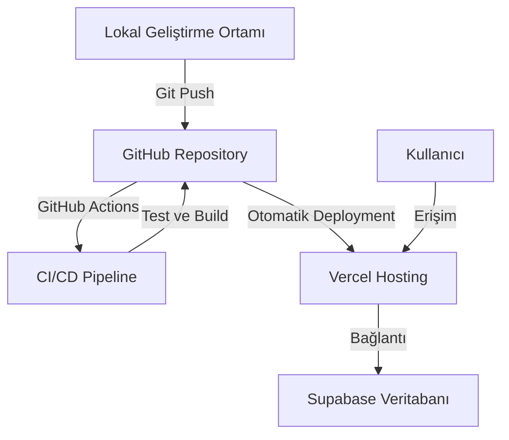

# Design Document

## Overview

Bu tasarım belgesi, Lise Defteri projesinin GitHub'a push edilmesi ve Vercel'e deploy edilmesi için teknik yaklaşımı detaylandırmaktadır. Belge, gerekli adımları, araçları ve güvenlik önlemlerini içermektedir.

## Architecture

Deployment mimarisi aşağıdaki bileşenlerden oluşmaktadır:

1. **Kaynak Kod Yönetimi**: GitHub
2. **Hosting Platformu**: Vercel
3. **Veritabanı**: Supabase
4. **CI/CD**: GitHub Actions ve Vercel otomatik deployment



## Components and Interfaces

### 1. Git ve GitHub Entegrasyonu

- **Git İşlemleri**: Projeyi Git ile yönetmek için gerekli komutlar
  - `git init`: Yeni bir Git deposu oluşturma
  - `git add .`: Tüm dosyaları staging area'ya ekleme
  - `git commit -m "mesaj"`: Değişiklikleri commit etme
  - `git remote add origin [repo-url]`: GitHub repository'sini bağlama
  - `git push -u origin main`: Değişiklikleri GitHub'a push etme

- **GitHub Repository Yapılandırması**:
  - Repository adı: lise-defteri
  - Açıklama: Advanced high school forum application
  - Görünürlük: Public (veya Private)
  - .gitignore: Node.js template
  - README.md: Proje açıklaması

### 2. CI/CD Pipeline (GitHub Actions)

- **GitHub Actions Yapılandırması**:
  - Workflow dosyaları: `.github/workflows/` dizininde
  - Ana workflow: `ci-cd.yml`
  - Branch bazlı workflow tetikleyicileri
  - Paralel test ve build işlemleri

- **CI Pipeline Bileşenleri**:
  - Lint kontrolü: `npm run lint`
  - Unit testler: `npm run test`
  - Build doğrulama: `npm run build`
  - Güvenlik taraması: Dependency check

- **CD Pipeline Bileşenleri**:
  - Otomatik deployment: Main branch için
  - Preview deployment: Pull request'ler için
  - Deployment onayı: Belirli branch'ler için manuel onay

### 3. Vercel Deployment

- **Vercel Entegrasyonu**:
  - GitHub hesabı ile Vercel'e giriş
  - GitHub repository'sini import etme
  - Build ayarları: Next.js framework
  - Environment variables yapılandırması
  - GitHub Actions ile entegrasyon

- **Deployment Ayarları**:
  - Framework Preset: Next.js
  - Build Command: `npm run build`
  - Output Directory: `.next`
  - Install Command: `npm install`
  - Development Command: `npm run dev`

### 4. Ortam Değişkenleri Yönetimi

- **Lokal Ortam**:
  - `.env.local` dosyası (git tarafından izlenmeyecek)
  - `.env.example` dosyası (hassas bilgiler olmadan, git tarafından izlenecek)

- **Vercel Ortamı**:
  - Vercel Dashboard > Project Settings > Environment Variables
  - Production, Preview ve Development ortamları için ayrı yapılandırma

## Data Models

### Environment Variables

```
# Supabase Configuration
NEXT_PUBLIC_SUPABASE_URL=<supabase-url>
NEXT_PUBLIC_SUPABASE_ANON_KEY=<supabase-anon-key>
SUPABASE_SERVICE_ROLE_KEY=<supabase-service-role-key>

# App Configuration
NEXT_PUBLIC_APP_URL=<app-url>
NEXT_PUBLIC_APP_NAME="Lise Defteri"
```

### .gitignore

```
# dependencies
/node_modules
/.pnp
.pnp.js

# testing
/coverage

# next.js
/.next/
/out/

# production
/build

# misc
.DS_Store
*.pem

# debug
npm-debug.log*
yarn-debug.log*
yarn-error.log*

# local env files
.env*.local

# vercel
.vercel

# typescript
*.tsbuildinfo
next-env.d.ts
```

## Error Handling

1. **Git/GitHub Hataları**:
   - Kimlik doğrulama hataları: GitHub token veya kimlik bilgilerinin doğruluğunu kontrol etme
   - Merge conflict: Lokal değişiklikler ile uzak değişiklikler arasındaki çakışmaları çözme
   - Push rejection: Uzak depodaki değişiklikleri önce çekme (`git pull`)

2. **Vercel Deployment Hataları**:
   - Build hataları: Build log'larını inceleme ve hataları düzeltme
   - Environment variable hataları: Eksik veya yanlış ortam değişkenlerini kontrol etme
   - Bağlantı hataları: Supabase bağlantısını kontrol etme

## Testing Strategy

1. **Lokal Test**:
   - Deployment öncesi lokal ortamda uygulamanın çalıştığından emin olma
   - Environment variables'ın doğru yapılandırıldığını kontrol etme

2. **CI/CD Test**:
   - GitHub Actions ile otomatik testler
   - Lint kontrolü ve kod kalitesi analizi
   - Unit ve integration testleri
   - Build doğrulama testleri

3. **Deployment Test**:
   - Vercel preview deployment URL'ini kontrol etme
   - Temel fonksiyonların çalıştığını doğrulama
   - Supabase bağlantısının çalıştığını doğrulama

4. **Post-Deployment Kontroller**:
   - Kullanıcı kaydı ve girişi
   - Forum işlevleri
   - Diğer kritik özelliklerin çalıştığını doğrulama

5. **Sürekli İzleme**:
   - Deployment sonrası performans izleme
   - Hata takibi ve raporlama
   - Kullanıcı deneyimi metriklerinin izlenmesi
## CI/CD W
orkflow Detayları

### GitHub Actions Workflow Yapısı

```yaml
# .github/workflows/ci-cd.yml
name: CI/CD Pipeline

on:
  push:
    branches: [ main, develop ]
  pull_request:
    branches: [ main, develop ]

jobs:
  lint:
    runs-on: ubuntu-latest
    steps:
      - uses: actions/checkout@v3
      - name: Setup Node.js
        uses: actions/setup-node@v3
        with:
          node-version: '18'
          cache: 'npm'
      - name: Install dependencies
        run: npm ci
      - name: Run linting
        run: npm run lint

  test:
    runs-on: ubuntu-latest
    steps:
      - uses: actions/checkout@v3
      - name: Setup Node.js
        uses: actions/setup-node@v3
        with:
          node-version: '18'
          cache: 'npm'
      - name: Install dependencies
        run: npm ci
      - name: Run tests
        run: npm test

  build:
    runs-on: ubuntu-latest
    needs: [lint, test]
    steps:
      - uses: actions/checkout@v3
      - name: Setup Node.js
        uses: actions/setup-node@v3
        with:
          node-version: '18'
          cache: 'npm'
      - name: Install dependencies
        run: npm ci
      - name: Build application
        run: npm run build
      - name: Upload build artifacts
        uses: actions/upload-artifact@v3
        with:
          name: build-output
          path: .next/

  deploy-preview:
    if: github.event_name == 'pull_request'
    runs-on: ubuntu-latest
    needs: build
    steps:
      - name: Deploy to Vercel (Preview)
        uses: amondnet/vercel-action@v20
        with:
          vercel-token: ${{ secrets.VERCEL_TOKEN }}
          github-token: ${{ secrets.GITHUB_TOKEN }}
          vercel-org-id: ${{ secrets.VERCEL_ORG_ID }}
          vercel-project-id: ${{ secrets.VERCEL_PROJECT_ID }}

  deploy-production:
    if: github.event_name == 'push' && github.ref == 'refs/heads/main'
    runs-on: ubuntu-latest
    needs: build
    environment:
      name: production
      url: ${{ steps.deploy.outputs.url }}
    steps:
      - name: Deploy to Vercel (Production)
        id: deploy
        uses: amondnet/vercel-action@v20
        with:
          vercel-token: ${{ secrets.VERCEL_TOKEN }}
          github-token: ${{ secrets.GITHUB_TOKEN }}
          vercel-org-id: ${{ secrets.VERCEL_ORG_ID }}
          vercel-project-id: ${{ secrets.VERCEL_PROJECT_ID }}
          vercel-args: '--prod'
```

### Branch Stratejisi

CI/CD pipeline'ı aşağıdaki branch stratejisi ile çalışacak şekilde tasarlanmıştır:

1. **Main Branch**: Production ortamı için kullanılır. Bu branch'e yapılan her push, tam CI/CD pipeline'ını tetikler ve başarılı olursa production ortamına otomatik deployment yapılır.

2. **Develop Branch**: Geliştirme ortamı için kullanılır. Bu branch'e yapılan her push, CI pipeline'ını tetikler ve başarılı olursa geliştirme ortamına deployment yapılır.

3. **Feature Branches**: Yeni özellikler için kullanılır. Bu branch'lerden develop branch'ine açılan pull request'ler, CI pipeline'ını tetikler ve preview deployment oluşturur.

4. **Hotfix Branches**: Acil düzeltmeler için kullanılır. Bu branch'lerden main branch'ine açılan pull request'ler, CI pipeline'ını tetikler ve başarılı olursa production ortamına deployment için onay bekler.

### Güvenlik Önlemleri

1. **Secrets Yönetimi**: Tüm hassas bilgiler (API anahtarları, token'lar vb.) GitHub Secrets olarak saklanır ve workflow dosyalarında doğrudan kullanılmaz.

2. **Dependency Scanning**: Güvenlik açıklarını tespit etmek için bağımlılıklar düzenli olarak taranır.

3. **Code Scanning**: GitHub Advanced Security ile kod güvenlik analizi yapılır.

4. **Environment Protection Rules**: Production ortamına deployment için onay gerektiren kurallar uygulanır.